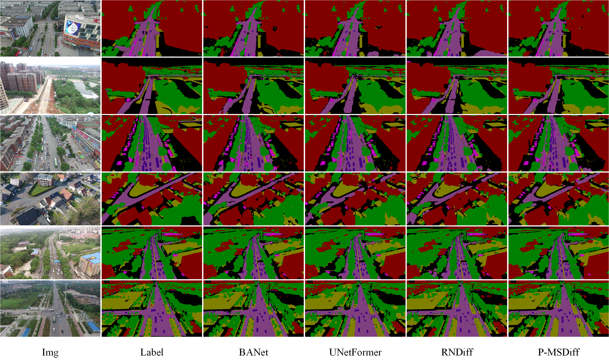

# P-MSDiff: Parallel Multi-Scale Diffusion for Remote Sensing Image Segmentation
!!The code will be made public after the paper is accepted

## Abstract
Diffusion models and multi-scale features are essential components in semantic segmentation tasks that deal with remote-sensing images. They contribute to improved segmentation boundaries and offer significant contextual information. U-net-like architectures are frequently employed in diffusion models for segmentation tasks. These architectural designs include dense skip connections that may pose challenges for interpreting intermediate features. Consequently, they might not efficiently convey semantic information throughout various layers of the encoder-decoder architecture. To address these challenges, we propose a new model for semantic segmentation known as the diffusion model with parallel multi-scale branches. This model consists of Parallel Multiscale Diffusion modules (P-MSDiff) and a Cross-Bridge Linear Attention mechanism (CBLA). P-MSDiff enhances the understanding of semantic information across multiple levels of granularity and detects repetitive distribution data through the integration of recursive denoising branches. It further facilitates the amalgamation of data by connecting relevant branches to the primary framework to enable concurrent denoising. Furthermore, within the interconnected transformer architecture, the LA module has been substituted with the CBLA module. This module integrates a semidefinite matrix linked to the query into the dot product computation of keys and values. This integration enables the adaptation of queries within the LA framework. This adjustment enhances the structure for multi-head attention computation, leading to enhanced network performance and CBLA is a plug-and-play module. Our model demonstrates superior performance based on the J1 metric on both the UAVid and Vaihingen Building datasets, showing improvements of 1.60\% and 1.40\% over strong baseline models, respectively.

## Visualization Results

  
  
The segmentation results on the UAVid dataset

  
  
Visualization on the Vaihingen Buildings dataset

